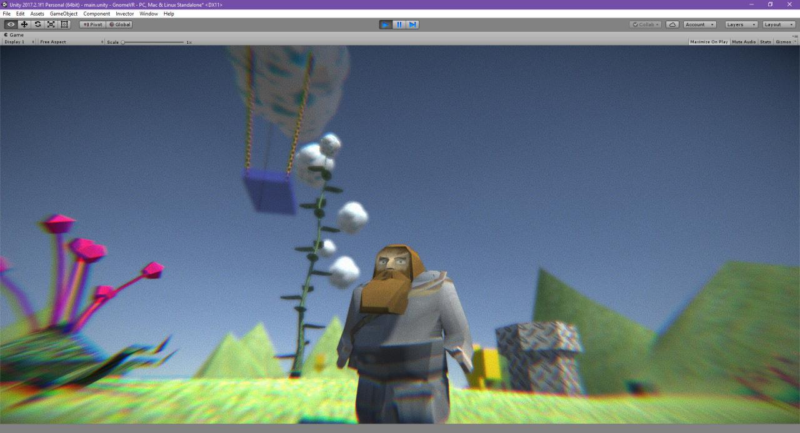

# gnome

G.N.O.M.E.: General Networked Organism Manufactured for Exploration

Unity 2017 project

* WebGL demo: https://joric.github.io/gnome
* You can also download an executable file from the [releases section](https://github.com/joric/gnome/releases).

## Models

All models here (except gnome) made by me from reference images (since 2008) and placed in the public domain.

* [gnome](unity/Assets/models/gnome) - based on the [orignal model](unity/Assets/models/gnome/gnome_max.zip) by [Asci](http://www.gamedev.ru/art/forum/?id=5592&page=34#m502) (texture mapping by [viv](http://www.gamedev.ru/art/forum/?id=5592&page=34#m507) and [Dam0b](http://www.gamedev.ru/art/forum/?id=5592&page=35#m514))
* [gnomeland](unity/Assets/models/gnomeland) - based on the [orignal image](unity/Assets/models/gnomeland/textures/gnomeland.3_4.jpg) by [Asci](http://www.gamedev.ru/art/forum/?id=5592)
* [gnomedog](unity/Assets/models/gnomedog) - based on the [orignal image](unity/Assets/models/gnomedog/textures/gnomedog.jpg) by [Polter](http://www.gamedev.ru/art/forum/?id=5592&page=156#m2335)
* [gnomecar](unity/Assets/models/gnomecar) - based on the [orignal image](unity/Assets/models/gnomecar/textures/gnomecar_orig.jpg) by [Dart_Vader](http://www.gamedev.ru/projects/forum/?id=8855&page=2#m16)
* [swiborg](unity/Assets/models/swiborg) - based on the [original image](unity/Assets/models/swiborg/textures/swiborg.jpg) by [Zudl](http://www.gamedev.ru/flame/forum/?id=66447)

I'm only responsible for the geometry, all reference images (sometimes reused as textures) belong to their owners.

## Textures

The following textures, apparently used by Asci in the gnomeland scene were taken from BodyPaint 3D and resized:

* [GLBRICKS.JPG](unity/Assets/models/gnomeland/textures/GLBRICKS.JPG) (originally [S019_c.jpg](unity/Assets/models/gnomeland/textures/S019_c.jpg), 205x205 px)
* [GLGROUND.JPG](unity/Assets/models/gnomeland/textures/GLGROUND.JPG) (originally [Dirtg02c.jpg](unity/Assets/models/gnomeland/textures/Dirtg02c.jpg), 256x205 px)

## Pictures

### Screenshot

## References

* http://www.gamedev.ru/art/forum/?id=5592

